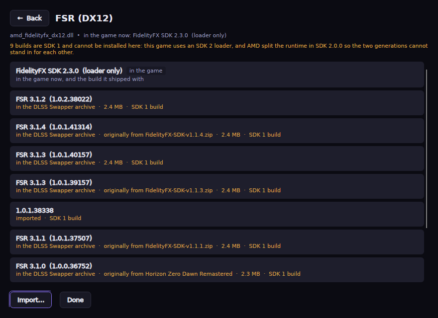

# Upscaler Manager


A **simple** desktop frontend for the upscalers in your games, on Linux first.

Two things a game might need, and this does both. Sometimes it needs
[**OptiScaler**](https://github.com/optiscaler/OptiScaler), so its existing DLSS option
can drive FSR or XeSS instead. Sometimes it just needs a **newer DLL** — a later DLSS,
FSR or XeSS build dropped in place. Either way you see exactly what will change before
anything is written, and everything is reversible.

> Windows is supported as the secondary target; macOS runs the UI. **This project is
> heavily AI-assisted** — see [How this project is built](#how-this-project-is-built).


<sub>Screenshots are rendered from the running app against a sample library.</sub>

## Get it

Download the archive for your platform from the
[latest release](https://github.com/filobus97/optiscaler-manager/releases/latest) and
run it. One self-contained binary: no runtime to install, and nothing written outside
the folder you unpacked and your config directory.

```bash
unzip UpscalerManager-<version>-linux-x64.zip -d ~/Apps/UpscalerManager
cd ~/Apps/UpscalerManager && chmod +x UpscalerManager && ./UpscalerManager
```

On Windows run `UpscalerManager.exe`. It updates itself from then on — **Settings →
Update now** downloads, applies and restarts, with no terminal, so it works in Steam
Gaming Mode.

## What it does

**Your games, as cards.** Cover art from Steam, the technologies each game already
carries with their versions, and whether OptiScaler is installed. A card has one
action: open the game.

**One page per game**, with one primary action.

- **OptiScaler** — install it, or reinstall and remove it.
- **Upscaler libraries** — one row per swappable DLL the game has, reading
  `DLSS 310.1.0.0 → 310.9.1.0` with where the newer build comes from. **Update** opens
  every build this app can reach, newest first.
- **Details**, collapsed: everything found next to the game, and what OptiScaler's ini
  is set to do.

**Builds come from four places**, and each row says which: your other games, the
OptiScaler releases already downloaded, files you import (DLLs or zips), and the
[DLSS Swapper](https://github.com/beeradmoore/dlss-swapper) archive of shipped builds.
Only the last needs the network, and it can be switched off.

**FSR has a guard nothing else has.** AMD split the FidelityFX runtime in SDK 2.0.0 —
a loader plus one module per effect — and made the loader compatible with the old
filename, so `amd_fidelityfx_dx12.dll` means two incompatible things. Both sides are
read out of the binaries, and a swap across that line is refused rather than left to
break the game silently. FSR 4 lives in a module most games do not ship at all, which
is why it stays OptiScaler's job.



**Installing shows the diff first.** Pick the release and the upscaler; everything else
has a default and lives under *Advanced*. The preview lists the exact files that will be
placed and the exact `OptiScaler.ini` keys that will change, and updates as you change
the options. Whatever is already there is backed up to a per-game store first, so
**Remove** puts it back.

**Reachable by D-pad throughout**, including the updater. It is meant to be used from a
Steam Deck in Gaming Mode: add it as a non-Steam game.

## What it will and will not download

The line is **redistributable or not**. Vendors publish the DLSS, FSR and XeSS SDK
libraries so they can ship inside games, and OptiScaler's releases bundle AMD's signed
FidelityFX DLLs on the same basis — those are fetched for you.

A binary its owner does not distribute separately is **never** downloaded, bundled or
linked. AMD's FSR 4 driver runtime is the example: it ships inside the Adrenalin driver
package, so it is strictly bring-your-own — imported from a file, folder or archive you
already have.

Two third-party sources are used only when you pick them, and neither is mirrored here:

- the FSR 4 INT8 builds from
  [`Agustinm28/OptiScaler-Extras`](https://github.com/Agustinm28/OptiScaler-Extras),
  for hardware whose driver provides no FSR 4. Recent ones ship under the same filename
  as AMD's runtime (`amdxcffx64.dll`) — a community replacement in the same slot, not
  AMD's binary.
- the [DLSS Swapper](https://github.com/beeradmoore/dlss-swapper) archive: a mirror
  rather than the publisher, so it is labelled as one on every row, checked against the
  hashes its index publishes, and switchable off in Settings.

## Build and test

```bash
dotnet build                                    # 0 warnings expected
dotnet test tests/UpscalerManager.Core.Tests    # the pure logic
dotnet publish src/UpscalerManager.App -c Release -r linux-x64 --self-contained
```

CI builds and tests `linux-x64` and `win-x64` on every push to `main`. A release is cut
by pushing a `v<version>` tag, or by pushing to `main` with `[release]` in the commit
message.

| Project | What it is |
| --- | --- |
| `src/UpscalerManager.Core` | UI-agnostic services: scanning, PE inspection, install, backup, swap. No Avalonia dependency. |
| `src/UpscalerManager.App` | The Avalonia UI. |
| `tests/UpscalerManager.Core.Tests` | xUnit tests for the logic that must not be wrong. |

[`DESIGN.md`](DESIGN.md) is the design contract — palette, four type sizes, geometry,
and the rules for writing both UI text and code comments. If a screen disagrees with
it, the screen is wrong. Two decisions that need more than a comment are written up in
[`docs/fidelityfx.md`](docs/fidelityfx.md) (AMD's SDK split and the generation guard)
and [`docs/swapping.md`](docs/swapping.md) (what this takes from DLSS Swapper, and
where it differs).

## How this project is built

This project is **heavily AI-assisted**. Most of the code was written by
[Claude](https://www.anthropic.com/claude) working from direction, review and hardware
testing by the maintainer. Stated plainly so you can judge for yourself:

- Every change is covered by a test suite that must pass on Linux and Windows before a
  release publishes, and the UI is driven end-to-end by a harness that renders the real
  window rather than mocking it.
- Anything touching your game files goes through the backup-and-manifest layer, and the
  app shows the file and `.ini` changes before writing them.
- Several bugs were found by rendering screenshots and reading them; the commit history
  records those rather than hiding them.
- None of that makes it infallible. Bugs are the maintainer's responsibility — report
  them and they get fixed. **Settings → Open the log folder**; attaching that file helps
  most.

## Supporting the project

Optional, and nothing in the app is gated behind it. Channels are in
**[DONATE.md](DONATE.md)** — currently [Ko-fi](https://ko-fi.com/B2W426SLFP).

## Attribution & license

**License: [GPL-3.0-or-later](LICENSE).**

Upscaler Manager is built on the work of others and preserves their attribution:

- The reused service layer comes from
  **[OptiScaler Client](https://github.com/Optiscaler-Client/Optiscaler-Client)**,
  originally by **[Agustín Montaña (Agustinm28)](https://github.com/Agustinm28)**. It
  was taken from a personal fork of that project, which has since been realigned with
  upstream and carries nothing of its own.
- The mod this app configures is **OptiScaler**, by the
  [upstream OptiScaler team](https://github.com/optiscaler/OptiScaler).
- The swapper's design and its download archive come from
  **[DLSS Swapper](https://github.com/beeradmoore/dlss-swapper)**, by
  **[Brad Moore (beeradmoore)](https://github.com/beeradmoore)** and its contributors —
  also GPL-3.0. No code was copied; what was taken is the swappable set, the
  hash-then-extract download discipline, and the archive of vendor builds this app links
  to and does not mirror. The years of collecting those builds are the part that could
  not be reimplemented.

This program is distributed in the hope that it will be useful, but **WITHOUT ANY
WARRANTY**; without even the implied warranty of MERCHANTABILITY or FITNESS FOR A
PARTICULAR PURPOSE. See the GNU General Public License for more details.
