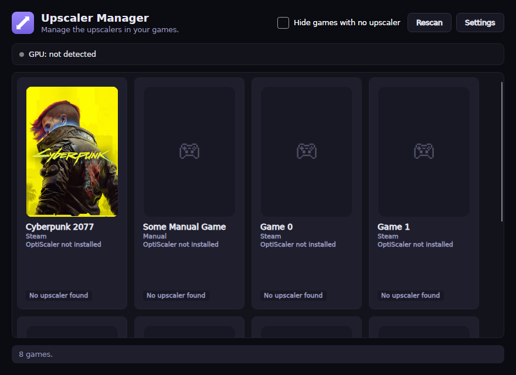
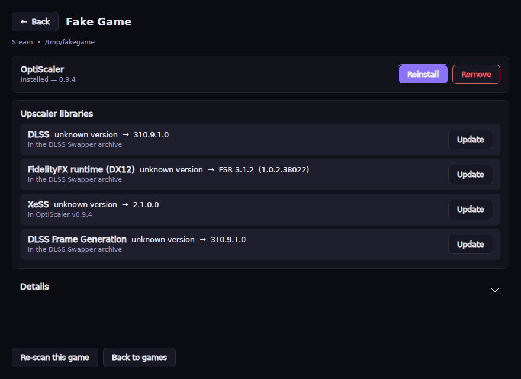
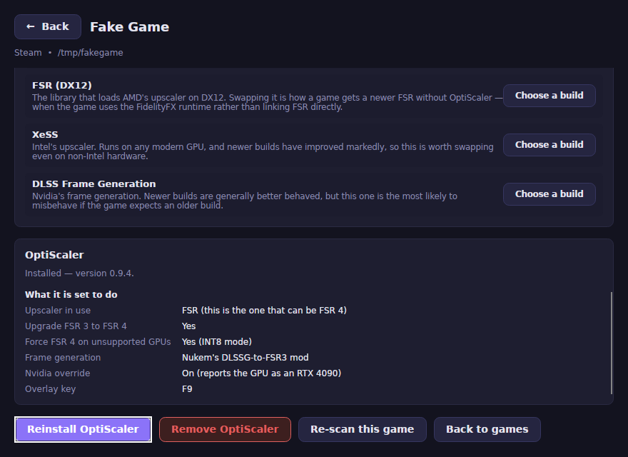
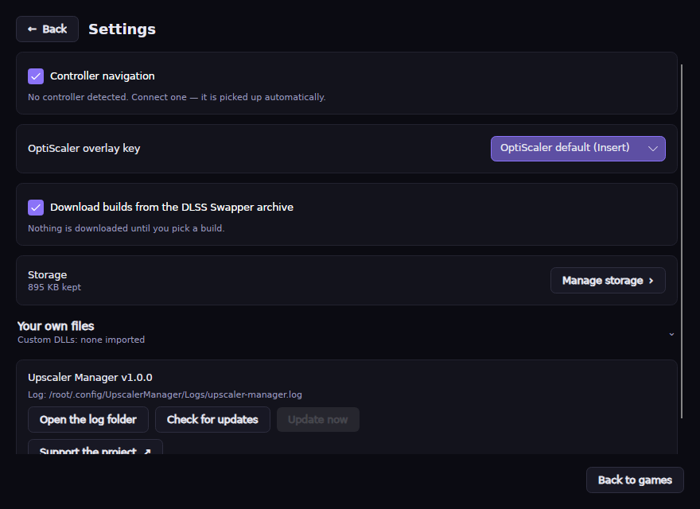
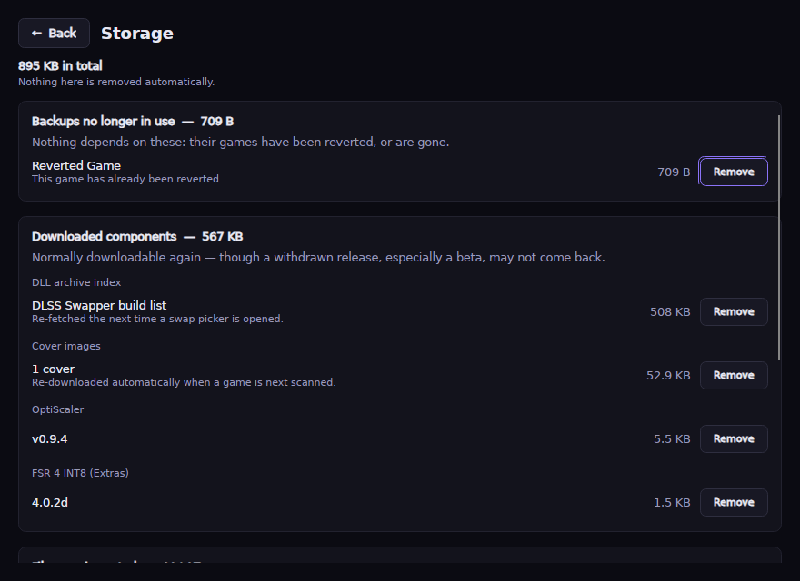
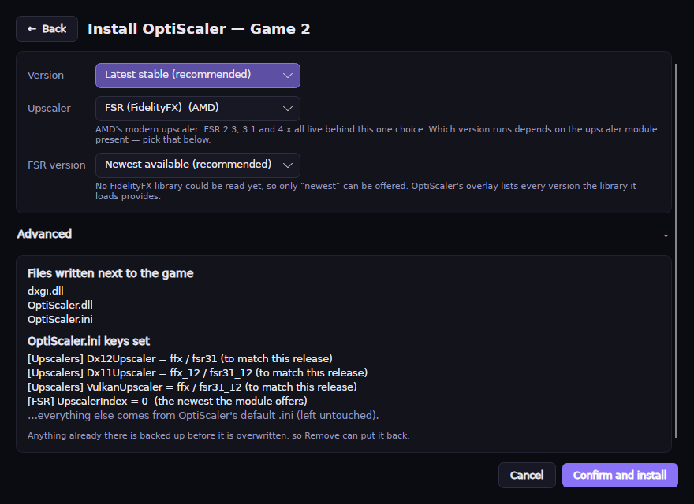

# Upscaler Manager


A deliberately **simple** desktop frontend for managing the upscalers in your games.

Sometimes a game just needs [**OptiScaler**](https://github.com/optiscaler/OptiScaler),
which lets its existing DLSS option drive FSR or XeSS instead. Sometimes all it needs
is a **newer DLL** — a later DLSS, FSR or XeSS build dropped in place. The app installs
OptiScaler today, and always tells you exactly what it is about to change.

> **Swapping DLLs directly is not built yet.** It is the next thing being added, and
> the reason the app is no longer called OptiScaler Manager. Until then this manages
> OptiScaler installs, and reports the upscaler DLLs it finds in each game.

It **reuses the proven service layer** of
[**OptiScaler Client**](https://github.com/Optiscaler-Client/Optiscaler-Client) —
the download/import, install and backup engines — but wraps it in a much smaller UI:
one screen, one primary action per game, advanced options tucked away.

> **Primary platform: Linux.** Windows is fully supported as the secondary
> target; macOS at least runs the UI. Windows-only install paths are guarded.
>
> **This project is heavily AI-assisted** — most of the code was written by Claude,
> with human direction, review and testing on real hardware. See
> [How this project is built](#how-this-project-is-built).



<sub>Screenshots show a sample game library.</sub>

---

## Get it

Grab the archive for your platform from the
[latest release](https://github.com/filobus97/optiscaler-manager/releases/latest),
unpack it anywhere, and run it. It is a single self-contained binary — no runtime to
install, nothing written outside the folder you unpacked and your config directory.

```bash
# Linux
unzip UpscalerManager-<version>-linux-x64.zip -d ~/Apps/UpscalerManager
cd ~/Apps/UpscalerManager && chmod +x UpscalerManager && ./UpscalerManager
```

On Windows, unpack and run `UpscalerManager.exe`. On a **Steam Deck**, add it as a
non-Steam game — it is fully usable from Gaming Mode with a controller, updates
included. See [Couch / Steam Deck use](#couch--steam-deck-bazzite-use).

It updates itself from then on: see [Updating in place](#updating-in-place).
Building from source is in [Building & running](#building--running).

---

## What it is (and what it deliberately isn't)

- **One primary screen.** A detected-GPU banner and your games as cover-art cards.
  Steam supplies the artwork; other launchers get a placeholder. A card shows what
  upscaling the game already has, at which versions, and whether OptiScaler is
  installed — and opens the game. Everything you can *do* to a game lives on its
  page, so a card has exactly one action and nothing to mis-click.

  The status line on a card reports **only OptiScaler**: its version if installed,
  or that it is not. Nothing more is claimed there, because whether FSR 4 actually
  *runs* depends on the `.ini`, the OptiScaler release and the GPU — the app cannot
  know it from the files alone. Below it, a chip per technology present — `DLSS`,
  `FSR`, `XeSS` — **colour-coded by vendor** (Nvidia green, AMD red, Intel blue).

  **Presence only, deliberately no version on a chip.** A game routinely carries
  more than one file for the same technology once OptiScaler is installed, at
  different versions, and nothing in the files says which one will load. Showing
  the newest read "FSR 4.1.1" on a game where the 4.0.2 community build had just
  been installed — both were there, and the choice between them is OptiScaler's.
  Versions belong per-file on the game's page, where each one is attributable.

  Three rows of chips fit on a card; beyond that the rest collapse into a `+N`
  chip, and the card's tooltip always lists every one.

- **Games with nothing to work with are labelled, and can be hidden.** A game with
  no DLSS, FSR or XeSS library gets a plain **"No upscaler found"** tag, because
  neither route helps it: OptiScaler *hooks* an upscaler a game already has rather
  than adding one, and there is nothing to swap. **Settings → Game list → Hide games
  with no upscaler** takes them out of the grid; the status bar then says how many
  are hidden. They stay scanned either way, so turning the filter off brings them
  straight back and a mis-detected game is never permanently invisible.

- **Installing OptiScaler** downloads and installs the *real OptiScaler
  release from source* (`optiscaler/OptiScaler` on GitHub) — **latest by default,
  or any older release from the version selector** at the top of the screen. The
  install screen then decouples the independent choices:

  **Step 1 — Which files to install:**
    - *OptiScaler default* (**recommended**): OptiScaler's release already bundles the
      newest FSR upscaler that release can hook (**FSR 4.1.1** since OptiScaler 0.9.4),
      so this alone enables FSR 4. There is deliberately **no "download newer FSR from
      AMD" option**: OptiScaler hooks AMD's model-selection code by byte pattern, so
      the only compatible AMD binaries are exactly the ones each release bundles —
      e.g. giving 0.9.3 a 4.1.1 upscaler silently disables FSR 4 (menu caps at 3.1.5);
    - *Custom DLLs* — **your imported DLLs overlaid on the OptiScaler install**: names
      OptiScaler ships (e.g. the upscaler) are swapped in place, unknown names (e.g.
      `amdxcffx64.dll`) are **added alongside**. Fully offline. Everything is
      manifest-tracked, so *Remove OptiScaler* takes it all back out;
    - *FSR 4 INT8 community build* — from
      [`Agustinm28/OptiScaler-Extras`](https://github.com/Agustinm28/OptiScaler-Extras)
      (third-party, **not** the official OptiScaler project), at a **version you pick**
      (upstream still recommends **4.0.2c** for RDNA2 on Windows).

  **Step 2 — FSR 4 selection:** the Manager **always forces the flag that makes FSR 4
  *available*** (`[FSR] Fsr4Update=true`); you then choose whether it also **selects**
  FSR 4 for you or leaves that to OptiScaler so you pick it in the in-game overlay.
  Selecting it writes `[Upscalers] Dx12Upscaler` (plus the DX11/Vulkan equivalents) —
  the setting that decides *which upscaler runs at all*, because the DX12 default is
  XeSS ([how that value is chosen](#choosing-the-upscaler-key)). Two optional toggles
  cover FSR 4.1.1's new GPU validation:
  **Force INT8 on unsupported GPUs** (`Fsr4ForceEnableInt8=true`, for RDNA2 / mobile
  RDNA3 / Intel / Nvidia — it can't help GPUs without INT8 support) and **Show the FSR4
  watermark** (`Fsr4EnableWatermark=true`) to verify on screen whether you're really
  getting FSR4 / FSR4-i8 or the silent FSR3 fallback.

  **Step 3 — Add-ons & extras:**
    - *fakenvapi* — `nvapi64.dll` + `fakenvapi.ini` from the
      [optiscaler/fakenvapi](https://github.com/optiscaler/fakenvapi) releases
      (auto-downloaded). Translates Nvidia Reflex into **AMD Anti-Lag 2 / LatencyFlex**;
    - *Nukem DLSSG-to-FSR3* — frame generation for games with DLSS-G
      (`dlssg_to_fsr3_amd_is_better.dll`, **bring-your-own** — import it once in
      Settings). Selecting it sets `[FrameGen] Enabled=true` and `FGInput=nukems`
      (OptiScaler defaults frame generation to off, so both are needed) and pulls
      fakenvapi in;
    - *Nvidia override* — for games that hide DLSS options on AMD/Intel. **Per game
      only** (chosen on this screen at each install; no global setting), with a
      **method selector**: *Default* uses OptiScaler's built-in DXGI spoofing
      (`[Spoofing] Dxgi=true`, adapter reports as an RTX 4090); *OptiPatcher*
      installs the `plugins/OptiPatcher.asi` plugin (`[Plugins] LoadAsiPlugins=true`),
      which patches the game's vendor checks in memory instead.

  Plus the **`OptiScaler.ini`** to use — OptiScaler's default, or one of your saved
  profiles. When you pick a custom `.ini`, the options above overwrite **only the keys
  they affect** (`Fsr4Update`, the `[Upscalers]` selection, the optional toggles above,
  and the menu key); the rest of your `.ini` is left exactly as you wrote it.
- **A details page per game.** *Details* opens in place and answers "what is in this
  game": every upscaling component found next to it — DLSS, FSR, XeSS, frame
  generation, latency libraries and runtimes — **with the version actually on disk**,
  what each one does in a sentence, and whether it shipped with the game or this app
  added it. When OptiScaler is installed it also says, in plain language, what it is
  set to do (which upscaler will really run, whether FSR 4 is on, frame generation,
  the Nvidia override, the overlay key). **Installing and removing both live here**,
  not on the cards, so neither is a stray click away.

  

  ...and, further down the same page, what OptiScaler is actually set to do:

  

- **One window, always.** Settings, the install screen and the details page replace
  the game list in place rather than opening windows of their own — gamescope (Steam's
  Gaming Mode) composites a single application surface, and one window also means the
  controller never has to guess where input should go. **Esc / B** goes back.
- **Transparent — no black boxes.** Before anything is written, a live
  **"What will happen"** preview lists the *exact files* that will be placed next
  to your game and the *exact `OptiScaler.ini` keys* that will change (updating as
  you change the options), so you can verify it or reproduce it by hand.
- **Tooltip-rich.** Every control explains what it does.
- **Your settings survive reinstalls.** Reinstalling (a newer OptiScaler, a different
  backend) keeps the `OptiScaler.ini` you already have — including everything OptiScaler
  writes back when you change settings in its in-game overlay — instead of resetting it
  to the release defaults.
- **Reversible.** *Remove OptiScaler* (on a game's details page) restores backed-up
  files from an external per-game backup store and reverts the ini keys.

### Which binaries this app will fetch, and which it will not

The line is **redistributable or not**, not proprietary or not. Vendors publish DLSS,
FSR and XeSS SDK libraries precisely so they can ship inside games, and OptiScaler
releases bundle AMD's signed FFX DLLs on the same basis — those are fine to download
for you.

What is **never** downloaded, bundled or linked to is a binary its owner does not
distribute separately. AMD's FSR 4 driver runtime is the current example: it ships
inside the Adrenalin driver package, so it is strictly **bring-your-own**, supplied
from a local file, folder or archive you already possess and copied into a private
cache.

Community builds are downloaded only when you explicitly pick them — currently the
FSR 4 INT8 builds from the third-party
[`Agustinm28/OptiScaler-Extras`](https://github.com/Agustinm28/OptiScaler-Extras)
repository. Note that recent INT8 builds ship *under the same filename*
(`amdxcffx64.dll`) — that is a community-built replacement occupying the same slot, not
AMD's binary. See [Importing your own DLLs](#importing-your-own-dlls-and-ini-profiles).

---

## How it works under the hood

The interesting design choice is that **components are modelled as data**, not as
per-screen glue. Each component (OptiScaler core, the FSR 4 INT8 backend, your
custom DLLs, fakenvapi, Nukem frame-gen, OptiPatcher) declares its **id, target
files, ini keys, and conflicts** in a small
[component registry](src/UpscalerManager.Core/Components/ComponentRegistry.cs).

Both of these are *derived* from that registry, with no bespoke logic:

- **Mutual exclusion** — e.g. the FSR 4 INT8 "Extras" backend and a custom
  upscaler DLL both write `amd_fidelityfx_upscaler_dx12.dll`, so they're
  automatically recognised as incompatible.
- **The "What will happen" preview** — the file and ini-key lists you see are the
  exact data the installer acts on.

### Choosing the upscaler key

`[Upscalers] Dx12Upscaler` decides which upscaler actually runs, and its default is
XeSS — while XeSS is running, none of the FSR settings are even read. The value that
selects FSR is **not the same across OptiScaler releases**: newer ones renamed `fsr31`
to `ffx`, and on those builds `fsr31` is not a DX12 option at all — it falls through to
FSR 2.1.2. Since the app can install older releases too, the codes are read from the
comments in the `OptiScaler.ini` that ships with the release being installed, and left
alone entirely when they cannot be determined. Guessing would silently downgrade the
upscaler.

(`[FSR] UpscalerIndex`, which older versions of this app wrote, is *not* that switch:
it picks which FSR version the FSR upscaler uses, its default is already `0`, and it is
only read from inside the FSR upscaler.)

The details page follows the same idea: what each upscaling file *is* lives in an
[upscaler catalogue](src/UpscalerManager.Core/Components/UpscalerCatalog.cs), so
supporting a new technology is one row of data rather than changes in three places.

### Project layout

| Project | What it is |
| --- | --- |
| `src/UpscalerManager.Core` | UI-agnostic service layer ported from OptiScaler Client + the component registry. No Avalonia dependency. |
| `src/UpscalerManager.App` | The Avalonia UI: one screen, the preview dialog, the import settings. |
| `tests/UpscalerManager.Core.Tests` | xUnit tests for the pure logic (PE inspection, ini editing, version gate, FSR SDK scan) and the registry. |

The Core layer was decoupled from the source project's two UI touchpoints:

- `DebugWindow.Log` → an injected [`ILog`](src/UpscalerManager.Core/Logging/ILog.cs)
  via a small static `Log` facade.
- the in-service NukemFG file dialog → an
  [`IManualComponentProvider`](src/UpscalerManager.Core/Prompts/IManualComponentProvider.cs)
  callback the host implements.

---

## Building & running

Requires the **.NET 10 SDK**.

```bash
# Build everything
dotnet build UpscalerManager.slnx -c Release

# Run the tests
dotnet test tests/UpscalerManager.Core.Tests/UpscalerManager.Core.Tests.csproj -c Release

# Run the app (framework-dependent, for development)
dotnet run --project src/UpscalerManager.App/UpscalerManager.App.csproj
```

To produce a self-contained single-file build for your platform:

```bash
dotnet publish src/UpscalerManager.App/UpscalerManager.App.csproj \
  -c Release -r linux-x64 --self-contained true -o publish
# RIDs: linux-x64 (primary), win-x64, osx-x64, osx-arm64
```

---

## Importing your own DLLs and `.ini` profiles

Open **Settings** to import:

- **Custom DLLs (one or more).** Pick individual `.dll` files (multi-select), a
  folder (searched recursively), or a `.zip`/`.7z`/`.rar` archive — every valid
  **64-bit** DLL is imported into a flat library (largest copy wins when a name is
  duplicated; re-importing a name replaces it; entries are individually deletable).
  At install time (the *Custom DLLs* backend) they are **overlaid on the OptiScaler
  install**: names OptiScaler ships are swapped in place, new names (e.g.
  `amdxcffx64.dll`) are added alongside. Legacy imports from older versions are
  migrated automatically.
- **Nukem's DLSSG-to-FSR3 DLL.** The frame-gen mod cannot be auto-downloaded — import
  `dlssg_to_fsr3_amd_is_better.dll` (or the mod archive) once, then tick the add-on
  per install. fakenvapi needs no import: it is downloaded from the
  optiscaler/fakenvapi releases when selected.
- **`OptiScaler.ini` profiles.** Import any `OptiScaler.ini`, tag it with a name,
  and it becomes selectable on the Install screen. Collect as many as you like;
  delete them from Settings.
- **Overlay / menu key.** OptiScaler's in-game overlay opens with **Insert** by
  default, but not every keyboard has that key. Pick another (Home, End, F1–F12, …)
  in **Settings** and it is forced as `[Menu] ShortcutKey` on **every** install,
  including the default `.ini`.



## Reclaiming disk space

Nothing the Manager downloads is ever deleted automatically — every OptiScaler
version you have installed, and every add-on, stays cached so it still works
offline. **Settings → Manage storage** shows what that costs and lets you remove
what you no longer want, grouped by how recoverable each thing is:

| Group | Removable | Why |
| --- | --- | --- |
| Backups no longer in use | Yes | The game was reverted, or is gone from the machine. Nothing depends on them. |
| Downloaded components | Yes | Normally downloadable again — though upstream does withdraw releases, especially betas and nightlies. |
| Files you imported | Yes, with confirmation | These came from you and this is the only copy. |
| Backups in use | **No** | The original files of a game that still has OptiScaler installed. |

That last row is the one that matters. **Revert restores from those backups and
has nowhere else to look**, so deleting one would strand the game in its modified
state, recoverable only by verifying the game's files in Steam/Epic. The screen
refuses to delete them and offers to revert the game instead — after which the
backup moves into the first group and can be removed normally.



When you click **Install OptiScaler**, the screen lets you pick which files to
install (OptiScaler default — first and pre-selected — then your custom DLLs, then
the INT8 community build) and which `.ini` profile to write. The Manager always sets `[FSR] Fsr4Update = true` and the
`[Upscalers]` selection per your Step-2 choice (these win over the chosen profile,
matching what is written to disk). You always see the exact file and ini changes
in the live preview first.



## Updating in place

The app **checks for new releases at launch** (and on demand from *Settings → About &
updates*). When a newer version exists, a dismissable banner appears with an **Update
now** button — **no terminal needed** (ideal from the couch). The check is best-effort;
offline it stays silent.

- **Linux / macOS** update **seamlessly in-process**: the app downloads the new build,
  swaps the files in place, and **restarts itself at the same process** — so it keeps
  running under **Steam Gaming Mode / gamescope** (Steam never sees the "game" stop, so
  the window comes right back). A brief flash and you're on the new version.
- **Windows** closes the app, runs the bundled updater, and **reopens it automatically**
  (a running `.exe` is locked, so it can't swap in place).

Your data is never touched — all settings, imported DLLs, `.ini` profiles, backups and
the download cache live in your OS config directory (`%APPDATA%\UpscalerManager` on
Windows, `~/.config/UpscalerManager` on Linux,
`~/Library/Application Support/UpscalerManager` on macOS), *outside* the install folder.

> Upgrading from **OptiScaler Manager**? That folder used to be named after the old
> product. It is moved across automatically on first launch, so settings, imported
> DLLs, `.ini` profiles and — most importantly — the per-game backups that *Remove
> OptiScaler* restores from all carry over.

You can also run the bundled updater by hand (e.g. to update a closed app). From the
install folder:

```bash
# Linux / macOS
sh update.sh                 # --force to reinstall, --dir <path> to target another install

# Windows (PowerShell)
powershell -ExecutionPolicy Bypass -File update.ps1   # -Force / -Dir <path>
```

The script detects your platform, compares the bundled `VERSION` with the latest
release, downloads the matching `UpscalerManager-<version>-<rid>.zip`, and swaps the
files in place. The scripts live in [`scripts/`](scripts/) if you want to run them
standalone.

## Where files come from, and what is checked

Everything the Manager downloads comes over HTTPS from GitHub release assets. There is
no other download host, and nothing is fetched from a URL you cannot see here:

| What | Repository | Whose |
| --- | --- | --- |
| OptiScaler itself | [`optiscaler/OptiScaler`](https://github.com/optiscaler/OptiScaler) | official project |
| OptiPatcher (Nvidia override) | [`optiscaler/OptiPatcher`](https://github.com/optiscaler/OptiPatcher) | official project |
| fakenvapi (Reflex → Anti-Lag 2) | [`optiscaler/fakenvapi`](https://github.com/optiscaler/fakenvapi) | official project |
| **FSR 4 INT8 community builds** | [`Agustinm28/OptiScaler-Extras`](https://github.com/Agustinm28/OptiScaler-Extras) | **third-party**, not the official project (recent releases ship as `amdxcffx64.dll`) |
| This app's own updates | [`filobus97/optiscaler-manager`](https://github.com/filobus97/optiscaler-manager) | this project |
| Nukem's DLSSG-to-FSR3 | — | **not downloaded**: you import it yourself |
| AMD's own FSR 4 runtime binary | — | **never downloaded**: bring your own |

Two of those deserve a second look. Despite the name, **OptiScaler-Extras is a personal
repository, not part of the official OptiScaler project** — the INT8 builds are community
work. And the version list is every release that repo publishes, so entries marked
*pre-release* are builds its author has not declared stable.

What the Manager actually verifies:

- every download is HTTPS from `github.com`;
- archives are opened and **only the one expected filename** is extracted, with paths
  validated so an archive cannot write outside the target folder;
- each extracted or imported DLL is checked to be a real **64-bit PE** before use;
- every file written is recorded in a per-game manifest, and *Revert* restores what was
  there before.

What it does **not** do: verify checksums or code signatures. GitHub-over-TLS is the
trust anchor, the same one you rely on when installing OptiScaler by hand. That applies
to this app too — it updates itself from its own releases, so treat it with the same
care you would any mod tool, and read the release notes before updating.

## Couch / Steam Deck (Bazzite) use

**Controllers work out of the box on Linux** — no Steam Input layout to configure:

| Control | Does |
| --- | --- |
| D-pad / left stick | Move between controls (hold to repeat) |
| Right stick | Scroll the page, like a wheel — push further to scroll faster |
| **A** | Confirm — press the focused button, tick a checkbox, open a dropdown and pick from it |
| **B** | Back out / close the dialog |
| **LB / RB** | Jump to the previous / next control |

The cards are a grid, and the D-pad moves through them the way the layout looks:
**left/right along a row, up/down between rows**, wrapping as the window resizes.
Press **A** to open a game, **B** to come back, and keep going up to leave the grid
for *Rescan* and *Settings*. A bright focus ring always shows where you are.

That navigation is not special-cased anywhere in the app — a card is a single
focusable control, so the toolkit's own directional focus handles it. The version
of this that needed hand-written code was the old three-column list.

The right stick scrolls whatever the focused control sits in — the game list on the
main screen, the page in Settings — without changing what is selected.

Settings and the install dialog open with something already focused, so the first press
always does something, and dropdowns open and commit with **A** (**B** cancels). The
keyboard does exactly the same things (arrows, Enter, Esc, Tab) — the two are the same
code path.

Controllers are detected automatically, including ones connected while the app is
running; *Settings → Controller* shows what is connected and lets you turn the feature
off. On Steam Deck, add the app as a **non-Steam game** and it is fully usable from
Gaming Mode, *Update now* included.

On first run under Linux the app registers a desktop entry
(`~/.local/share/applications/UpscalerManager.desktop`) and its icons under
`~/.local/share/icons/hicolor/`. That is what puts it in the application menu with a
proper taskbar icon — Wayland compositors take the icon from the desktop entry rather
than from the window, so without it the taskbar can only show a placeholder. Delete
those two paths to undo it.

> **Why this is built in:** Avalonia has no gamepad backend on Linux, so the app reads
> the controller itself (`/dev/input`, evdev) and translates it into the same
> navigation the keyboard produces. If your user cannot read input devices, Settings
> says so — `sudo usermod -aG input $USER` and log back in. If a Steam Input layout is
> already emitting keystrokes for the same pad, the app notices that every press is
> arriving twice and leaves navigation to it (the scroll stick keeps working), so the
> two don't fight; Settings says when this has happened.

**Controller not responding?** Run the built-in diagnostic from the install folder:

```bash
./UpscalerManager --gamepad-test
```

It lists every input device, marks the ones that report as controllers, shows the axes
each one declares and which two the scroll stick will read, says which it could open,
then echoes decoded input for 20 seconds — enough to tell "not detected"
from "detected but another program holds it" from "no permission".

## Windowing backend (Linux)

The app targets **Avalonia 12.1** and runs on **X11 by default** — through XWayland
when you are in a Wayland session. Avalonia's native Wayland backend is available with
`OSM_BACKEND=wayland`:

```bash
OSM_BACKEND=wayland ./UpscalerManager   # native Wayland (no app icon, see below)
OSM_BACKEND=x11     ./UpscalerManager   # force X11 (the default)
```

**Why X11 is the default:** the native Wayland backend is *experimental* upstream and,
as of Avalonia 12.1.2, never sends `xdg_toplevel.set_app_id` and implements no icon
protocol. A Wayland compositor therefore has no way to tell which application a window
belongs to, so it shows a placeholder icon in the title bar regardless of what the app
sets — nothing this app can do fixes that from its side. On X11 the icon is attached to
the window directly (`_NET_WM_ICON`) and `WM_CLASS` matches the desktop entry, so the
icon shows up in the title bar, the taskbar and the switcher.

If a future Avalonia release sends an app-id, native Wayland becomes the better default
again.

---

## Cutting a release

CI (`.github/workflows/ci.yml`) builds and tests on `linux-x64` and `win-x64` for
every push/PR to `main`. Releases (`.github/workflows/release.yml`) publish
self-contained single-file builds for **`linux-x64`, `win-x64`, `osx-x64`,
`osx-arm64`**, zip each as `UpscalerManager-<version>-<rid>.zip`, and attach
them to an auto-created GitHub Release.

A release can be cut three ways:

1. **Push a tag** `v<version>` (e.g. `v0.1.0`).
2. **Push to `main` with `[release]`** in the commit message — the version is
   read from `src/UpscalerManager.App/UpscalerManager.App.csproj`, and the
   tag is created for you. (Useful when the environment blocks direct tag pushes.)
3. **Run the *Release* workflow manually** (`workflow_dispatch`) and pass the
   version.

---

## How this project is built

This project is **heavily AI-assisted**. Most of the code was written by
[Claude](https://www.anthropic.com/claude) (Anthropic) working from direction,
review and hardware testing by the maintainer. That includes the service layer
ported from OptiScaler Client, the UI, the tests, and these docs.

What that means in practice, stated plainly so you can judge for yourself:

- Changes are covered by an automated test suite that must pass on Linux and
  Windows before a release can be published, and the UI is driven end-to-end by a
  harness that renders the real window rather than mocking it.
- Anything that touches your game files goes through a backup-and-manifest layer,
  and the app shows the exact file and `.ini` changes before writing them.
- Several bugs in this README's own claims were found by rendering screenshots and
  reading them; the commit history records those rather than hiding them.
- None of that makes it infallible. Bugs are the maintainer's responsibility, not
  the tool's — report them and they get fixed.

## Supporting the project

Entirely optional, and nothing in the app is gated behind it. The channels live
in **[DONATE.md](DONATE.md)**, and *Settings → Support the project* links there
rather than to a platform directly — so a channel can be added or corrected with
a commit instead of a release, and every installed copy follows immediately.

[](https://ko-fi.com/B2W426SLFP)

Currently **[Ko-fi](https://ko-fi.com/B2W426SLFP)**, which takes **no platform fee
on tips** — apart from the payment processor's own cut it arrives intact. One-off
payments, by card or PayPal. There is deliberately **no direct PayPal link**:
donations sent that way carry commercial fees, stay reversible for months, and
expose the recipient's legal name and address to the payer.

Bug reports with a log, and reports of what the app did on hardware nobody here
owns, are worth more than money.

---

## Attribution & license

**License: [GPL-3.0-or-later](LICENSE).**

Upscaler Manager is built on the work of others and preserves their attribution:

- The reused service layer comes from
  **[OptiScaler Client](https://github.com/Optiscaler-Client/Optiscaler-Client)**,
  originally by **[Agustín Montaña (Agustinm28)](https://github.com/Agustinm28)**.
  It was taken from a personal fork of that project, which has since been realigned
  with upstream and carries nothing of its own.
- The mod this app configures is **OptiScaler**, by the
  [upstream OptiScaler team](https://github.com/optiscaler/OptiScaler).

This program is distributed in the hope that it will be useful, but **WITHOUT ANY
WARRANTY**; without even the implied warranty of MERCHANTABILITY or FITNESS FOR A
PARTICULAR PURPOSE. See the GNU General Public License for more details.
